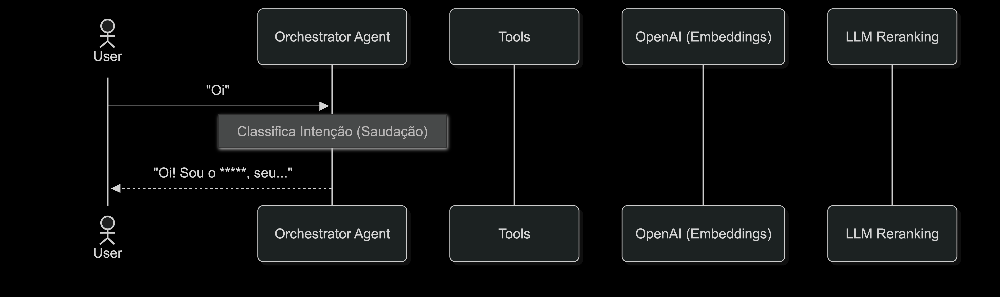
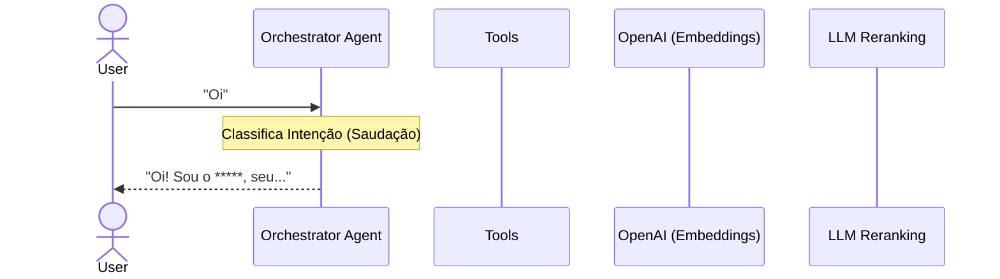
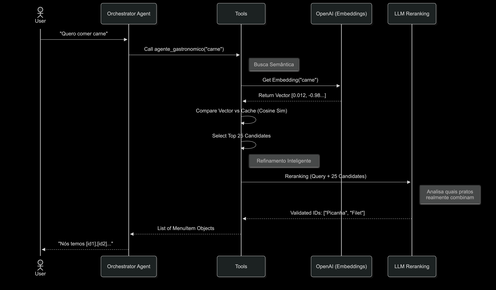
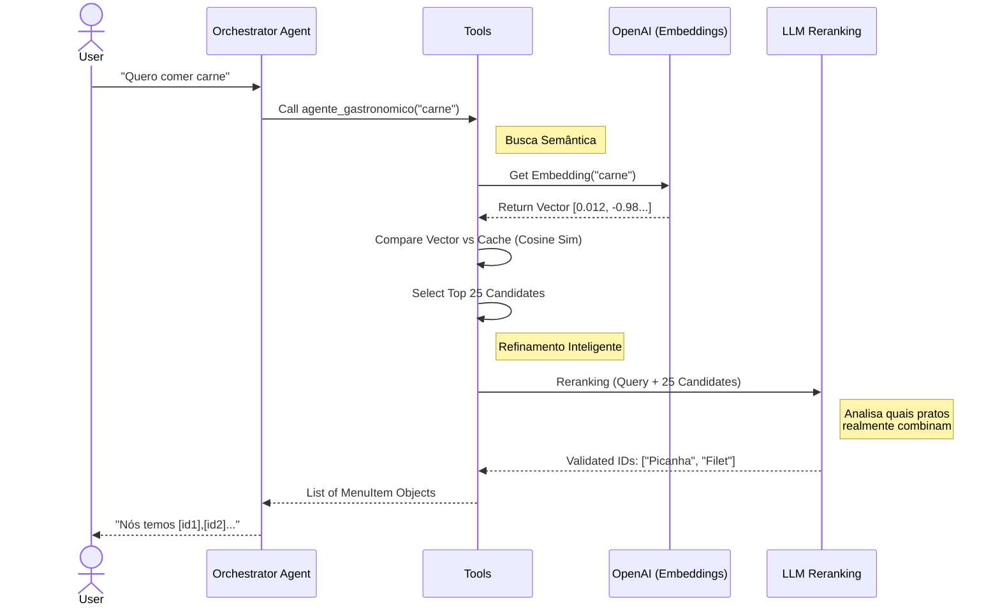

# Documentação Completa do Sistema Menux

Este documento descreve o funcionamento do **Menux**, o agente de recomendação gastronômica inteligente. 

## Arquitetura Geral

O sistema é construído em **Python** utilizando **PydanticAI** para orquestração de Agentes e **OpenAI API** para inteligência.

**Componentes Principais:**
1.  **`agent.py`**: O cérebro central. Define o Agente, o Prompt do Sistema e as Ferramentas (Tools) disponíveis.
2.  **`tools.py`**: Onde a mágica acontece. Contém a lógica de busca, embeddings e reranking.
3.  **Memória Vetorial (Cache)**: Um dicionário em memória que guarda os "mapas" dos itens do cardápio.

## Fluxo Detalhado de Uma Requisição

Quando o usuário envia uma mensagem (ex: *"Quero comer uma massa"*), o seguinte fluxo ocorre:

### 1. Recepção e Decisão (Agent Routing)
O `agent.py` recebe o texto. O LLM principal (GPT-4o-mini) analisa se o usuário está:
*   **Conversando**: *"Oi, tudo bem?"* -> Responde direto.
*   **Pedindo Comida**: *"Quero massa"* -> Decide chamar a tool `consultar_cardapio`.

### 2. A Tool `agente_gastronomico` (`tools.py`)
Ao ser acionada, esta ferramenta executa um pipeline de 3 estágios:

#### Estágio A: Geração de Embeddings (Vector Search)
O sistema precisa converter o texto do usuário em números (vetores) para encontrar similaridade matemática.
*   **Input**: "Quero comer uma massa"
*   **Modelo**: `text-embedding-3-small` (OpenAI).
*   **Output**: Um vetor de 1.536 números flutuantes (ex: `[0.012, -0.98, 0.45...]`).

Este vetor representa o **significado semântico** da frase.
*   O vetor de "Massa" está matematicamente próximo do vetor de "Macarrão", "Lasanha", "Molho".
*   O vetor de "Massa" está longe do vetor de "Picanha" ou "Refrigerante".

#### Estágio B: Busca Vetorial (Cosseno)
O sistema compara o vetor do usuário com os vetores de **todos** os itens do cardápio (que já foram carregados e cacheados na inicialização).

*   **Cálculo**: Similaridade de Cosseno (Cosine Similarity).
*   **Filtragem Inicial**: Selecionamos os itens com similaridade > 0.15.
*   **Ordenação**: Do maior score para o menor.
*   **Corte (Pool)**: Pegamos os **Top 25** itens.

> **Por que 25?**
> Para garantir "Recall" (Revocação). Se pegássemos só o Top 1, poderíamos pegar o item errado se a similaridade fosse ambígua. Com 25, garantimos que o item certo está no meio do bolo, pronto para ser filtrado.

#### Estágio C: Reranking Inteligente (LLM Filtering)
Aqui entra a "Inteligência Real" que diferencia o Menux.

A busca vetorial é rápida, mas "burra" para nuances. Ela pode achar que "Doce de Leite" é similar a "Leite Integral", mas um é sobremesa e o outro bebida.

Para corrigir isso, chamamos o `gpt-4o-mini` novamente com uma função interna `_rank_items_with_llm`.
*   **Prompt do Sistema**: *"Você é um especialista. O usuário pediu X. Desta lista de 25 candidatos, quais realmente atendem ao pedido? Seja rigoroso."*
*   **Entrada**: Query do usuário + Lista crua dos 25 itens.
*   **Saída**: JSON array com os IDs dos itens validados (ex: `["id_bolo", "id_tortinha"]`).

Se o LLM disser que nenhum dos 25 serve, retornamos vazio (melhor não sugerir nada do que sugerir errado).

### 3. Resposta Final
O Agente recebe os itens filtrados e gera a resposta em linguagem natural, usando as regras de personalidade definidas no `prompts.py` (ex: descrever sensorialmente, não usar termos de venda, ser breve).

## Resumo das Tecnologias

| Componente | Tecnologia / Modelo | Função |
| :--- | :--- | :--- |
| **Orquestrador** | PydanticAI | Gerenciar estado, dependências e tools. |
| **LLM Principal** | GPT-4o-mini | Conversa, decisão de tools e reranking final. |
| **Embeddings** | text-embedding-3-small | Transformar texto em vetores numéricos. |
| **Banco Vetorial** | Numpy (In-Memory) | Cálculo rápido de similaridade de cosseno. |

## Diagrama de Sequência (Saudação)

## Diagrama de Sequência (Pedido)

